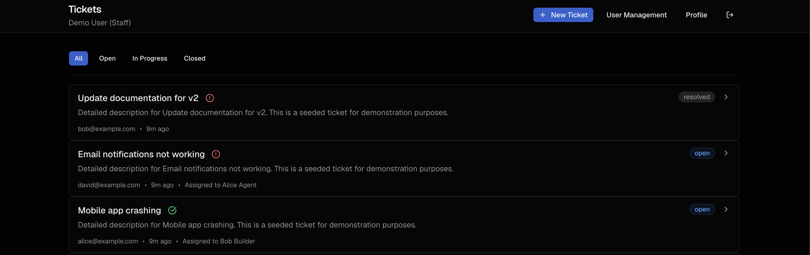
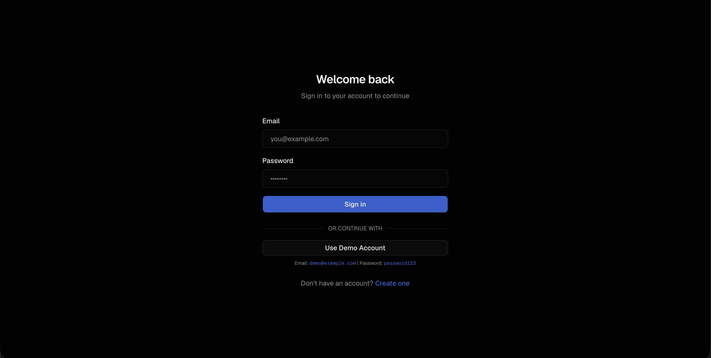
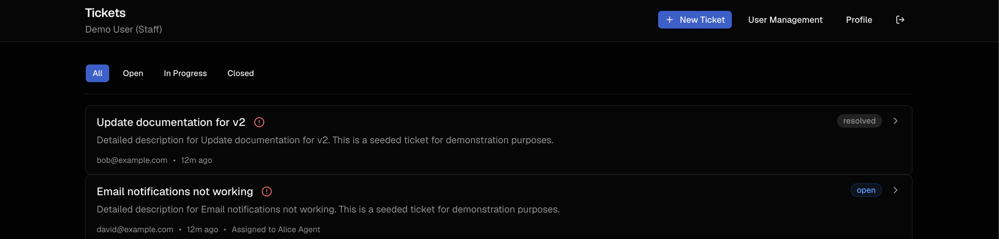
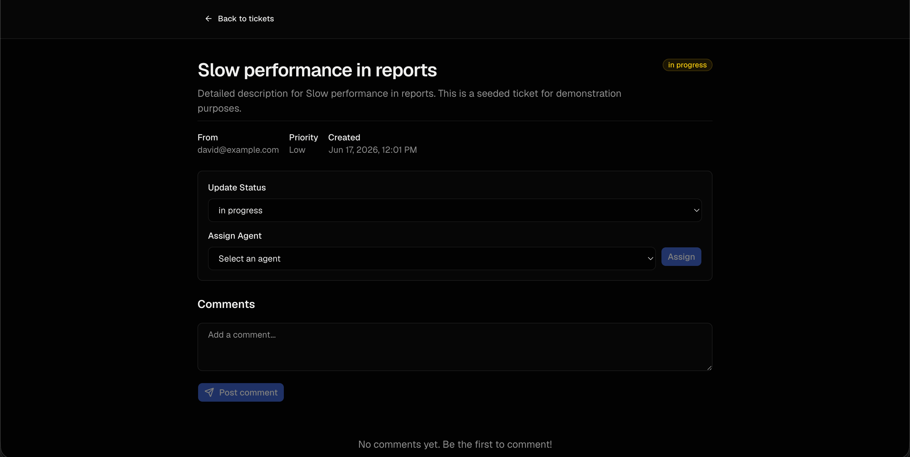
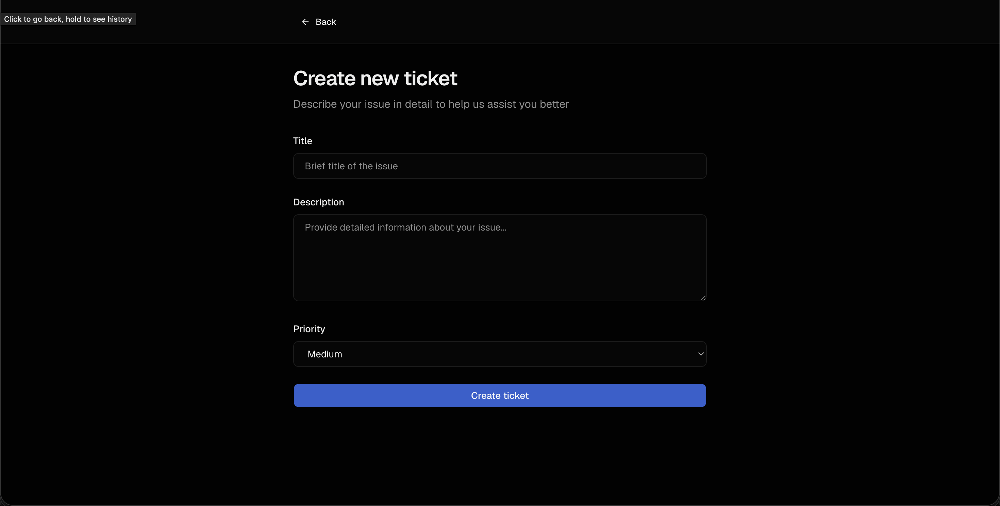
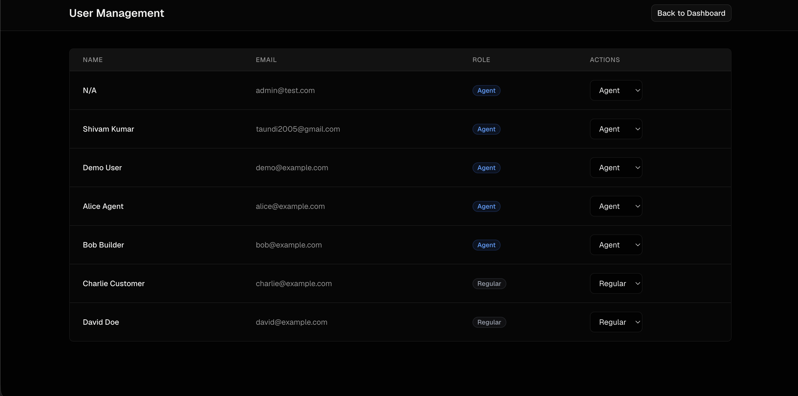
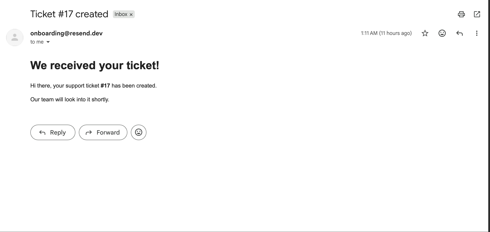

# 🎫 TicketFlow

A modern full-stack ticket management system built with **Django**, **Next.js**, **PostgreSQL**, **Celery**, and **Redis**.

TicketFlow enables organizations to manage support requests efficiently through role-based access control, ticket assignment workflows, status tracking, comments, and automated email notifications.

---

## 🚀 Live Demo

**Frontend:** `https://ticketflow-fullstack.vercel.app/`

**Backend API:** `https://ticketflow-fullstack.onrender.com`

### Demo Accounts

| Role  | Email                                       | Password    |
| ----- | ------------------------------------------- | ----------- |
| Admin | [demo@example.com](mailto:demo@example.com) | password123 |

> Demo accounts are provided for recruiters and visitors to explore the application without registration.

---

# 📸 Screenshots

## Dashboard



---

## Login Page



---

## Ticket List



---

## Ticket Details



---

## Create Ticket



---

## User Management (Admin)



---

## Email Notification



---

# ✨ Features

### Authentication

* User Registration
* User Login / Logout
* JWT Authentication
* Protected Routes

### Ticket Management

* Create Tickets
* View Ticket Details
* Track Ticket Status
* Add Comments
* Filter Tickets by Status

### Role-Based Access Control

#### Customers

* Create tickets
* View their own tickets
* Add comments on their tickets

#### Agents/Admins

* View all tickets
* Update ticket status
* Assign tickets
* Manage users and roles

### User Management

* Assign Customer or Agent roles
* Manage system users
* Role-based permissions

### Email Notifications

Asynchronous email notifications powered by Celery and Redis:

* Ticket Created → Email sent to creator
* Ticket Assigned → Email sent to assigned user

### Performance

* Background task processing with Celery
* Redis message broker
* Non-blocking email delivery

---

# 🏗️ Tech Stack

## Frontend

* Next.js
* TypeScript
* Tailwind CSS
* shadcn/ui
* Axios

## Backend

* Django
* Django REST Framework
* JWT Authentication

## Database

* PostgreSQL

## Async Processing

* Celery
* Redis

## Deployment

* Frontend: Vercel
* Backend: Render
* Database: Supabase PostgreSQL

---

# 📂 Project Structure

```text
ticketflow/
│
├── backend/
│   ├── tickets/
│   ├── users/
│   ├── config/
│   └── requirements.txt
│
├── frontend/
│   ├── app/
│   ├── components/
│   ├── lib/
│   └── package.json
│
├── screenshots/
│   ├── image.png
│   ├── image-1.png
│   ├── image-2.png
│   ├── image-3.png
│   ├── image-4.png
│   ├── image-5.png
│   └── image-6.png
│
└── README.md
```

---

# 🔄 Ticket Workflow

```text
Customer Creates Ticket
          │
          ▼
      Open Ticket
          │
          ▼
 Admin/Agent Assigns Ticket
          │
          ▼
 Email Notification Sent
          │
          ▼
   Status Updated
          │
          ▼
      Resolved
```

---

# 🛠️ Local Setup

## Clone Repository

```bash
git clone https://github.com/<your-username>/ticketflow.git

cd ticketflow
```

## Backend Setup

```bash
cd backend

python -m venv venv

source venv/bin/activate

pip install -r requirements.txt

python manage.py migrate

python manage.py runserver
```

Backend runs on:

```text
http://localhost:8000
```

---

## Frontend Setup

```bash
cd frontend

npm install

npm run dev
```

Frontend runs on:

```text
http://localhost:3000
```

---

## Celery Worker

```bash
celery -A config worker -l info
```

---

## Redis

```bash
redis-server
```

---

# 🔐 Environment Variables

## Backend

```env
SECRET_KEY=

DEBUG=False

DATABASE_URL=

REDIS_URL=

EMAIL_API_KEY=
```

## Frontend

```env
NEXT_PUBLIC_API_URL=
```

---

# 🎯 Future Improvements

* Ticket priority levels
* Ticket attachments
* Search functionality
* Dashboard analytics
* Activity logs
* Real-time notifications
* SLA tracking
* Dark mode

---

# 👨‍💻 Author

**Shivam Kumar**

Computer Science Engineering Student

Built as a portfolio project to demonstrate:

* Full-stack development
* REST API design
* Authentication & authorization
* Background task processing
* Database integration
* Modern frontend development

---

## ⭐ If you found this project useful, consider giving it a star.
